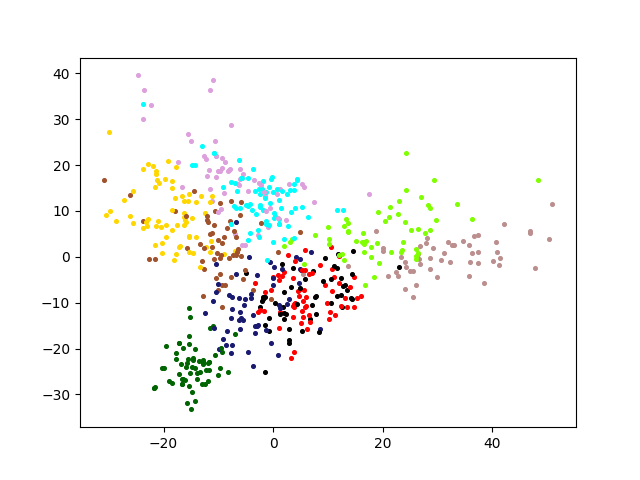

# MusicGenreClassification

## Introduction

The project aims to classify preprocessed 30s music clips according to music genre tags (rock, pop, classic, etc.).

The project is implemented in Python and MXNet.

# Feature

## Preprocess

* Mel-Frequency
* Log Power

* 5 channel better than 1 channel (preprocess_final.py)

## Model

* Different size of convolution kernel in different layers
* Concatenate last three layers with different sizes
* Two fully-connected layer (solve non-linear problem)

## Train

* Data setup (10 Genres, 60% Train, 40% Validation)
* Test data (downloaded from netease music)
* SGD, 8 as batch size
* ReLU http://proceedings.mlr.press/v15/glorot11a/glorot11a.pdf
* Dropout http://www.cs.toronto.edu/~fritz/absps/dropout.pdf

## Post-process

* Extract feature from layer "fc1"
* Use Principle Component Analysis to reduce dimension of feature

## Experiment

* Accuracy, Top-3 accuracy, generalization error (compare with other paper, compare with 1 channel) 
  * https://courses.engr.illinois.edu/ece544na/fa2014/Tao_Feng.pdf
  
| Experiment | Accuracy | Top-3 Accurcay | Generalization Error | 5-NN Error |
|------------|----------|----------------|----------------------|------------|
| 5-channel Train  |   0.998   | 1.000 | 0.010 | 0.003 |
| 5-channel Test | 0.725 | 0.922 | 0.353 | 0.335 |
| 5-channel Test | 0.407 | 0.627 | 0.310 | 0.310 |

* Result of PCA

* Cluster test on song lists of netease music (Future work)

## Discussion

* High accuracy on Train set and Val set:
* Low accuracy on Test set: 
  * inaccurate label
  * different source of music
  * Generalization Error is relatively low -> cluster and recommendation are possible
  * Migration study

data file link: https://drive.google.com/drive/folders/1WQ0koI3FuHLLomt8itUAH0475ZfuN303?usp=sharing
